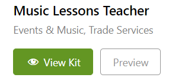

<h1>Workshop WordPress</h1>

1. Introduction
2. Installation
3. Réglages
4. Thèmes
5. Plugin
6. Création de plugin

# 1. Introduction

Dans ce repository, nous allons vous expliquer comment lancer son premier site WordPress. Vous allez aussi voir des conseils pour avoir des bons régles.
Vous allez apprendre aussi comment installer un plugin et un thème pour votre site.

# 2. Installation et Premier site

- Aller sur www.wordpress.org
  
- Cliquer sur Get Wordpress
  

- Décompresser le dossier wordpress

- Garder le dossier WordPress a un endroit accessible (Il sera utile par la suite)

- Vous avez besoin d'un serveur local (ex: MAMP, WAMP, XAMP,..)
  
- Lancer le serveur local

- Créer votre dossier dans le dossier htdocs

- Copier/coller le contenu du dossier Wordpress dans le dossier que vous avez créé.

- Rendez-vous sur PHPMyAdmin pour créer une base de données

- Créer une base de donnée qui porte le nom de votre dossier

- vous pouvez quitter PHPMyAdmin
  
- Vous pouvez lancer votre premier site Wordpress en inscrivant l'url suivant :
    localhost/"nom du dossier" (ex: localhost/test)

- Compléter les champs suivant :
        - Base de données : "nom de votre base de donnée"
        - identifiant : c'est votre identifiant phpmyadmin
        - mot de passe : mot de passe phpmyadmin
        - Ne pas modifier les 2 derniers champs

- Compléter les champs suivant : 
        - Titre du site : Choisissez un titre pour votre site (modifiable par la suite)
        - Identifiant : Inscrivez ce que vous voulez (ex: Admin)
        - Mot de passe : Choisissez un mot de passe très complexe (Si vous faites      juste un test, vous pouvez inscrire "admin")
        - Si votre mot de passe est faible, cochez la case juste en dessous
        - Inscrivez votre e-mail

Voilà vous pouvez commencer à créer votre premier site WordPress !

# 4. Thème

- Pour avoir de chouette thème gratuit, il existe Envato Element.

- Vous pourrez dès lors avoir accès au thème gratuit ou par block gratuit.

- Vous pourrez choisir une catégorie spécifique ou faire une simple recherche.

- Une fois votre thème choisis, il reste plus qu'a faire un "intall kit"

- Vous pouvez cliqué sur "view kit"

- Maintenant, vous aurez le choix entre plusieurs template en rapport avec le thème intaller. Vous pouvez évidemment regarder à quoi va ressembler le template avec de le choisir.

# 5. Plugin

- Lorsque vous voulez faire un plugin, vous devez ouvrir dans votre éditeur de code (ex: VsCode), le dossier que vous avez crée dans "htdocs" ou "www".

- Une fois dans ouvert dans votre éditeur, ouvrez ensuite le dossier que vous avez crée pour WordPress.

- Ensuite, vous allez dans wp-content, plugins puis vous créez un dossier qui contiendra votre plugin (ici c'est: "headerplugin").
- Vous ouvrez le dossier "headerplugin" et vous devez crée un fichier du même nom (attention de ne pas oublier le ".php").

- Une fois ceci fait, vous devez nommé et définir certaine variables pour votre plugins ( voir ici: [Doc WordPress](https://developer.wordpress.org/plugins/plugin-basics/header-requirements/)).

- Quand votre plugin est bien nommer/décris, il reste le code à faire et voici [un site](https://themeisle.com/blog/code-snippets-for-wordpress/) pour des petits tips utile. (dans l'exemple de cet exercice, j'ai pris le n°6)

- Voilà, il ne reste plus qu'a activé votre plugin dans les extensions.

